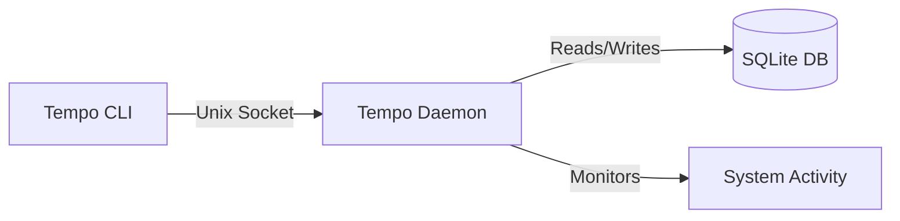

# Tempo

> **Simple, Fast, and Privacy-Focused Time Tracking for Developers**

[](https://pypi.org/project/tempo-cli/)
[](https://crates.io/crates/tempo-cli)
[](https://opensource.org/licenses/MIT)
[](https://pypi.org/project/tempo-cli/)

Tempo is a lightweight, terminal-based time tracking tool designed specifically for developers. It automatically detects your project context, tracks time with precision, and stores everything locally. No cloud services, no subscriptions, just a fast binary that gets out of your way.

---

## 📖 Table of Contents

- [Why Tempo?](#-why-tempo)
- [Features](#-features)
- [Architecture](#-architecture)
- [Installation](#-installation)
- [Quick Start](#-quick-start)
- [Usage Guide](#-usage-guide)
  - [Session Management](#session-management)
  - [Project Management](#project-management)
  - [Reporting](#reporting)
  - [Interactive UI](#interactive-ui)
- [Configuration](#-configuration)
- [Troubleshooting](#-troubleshooting)
- [Contributing](#-contributing)
- [License](#-license)

---

## 🚀 Why Tempo?

- **Zero Friction**: Start tracking in seconds. Tempo infers your project from your current directory.
- **Local & Private**: Your data lives on your machine in a standard SQLite database. You own it.
- **Resource Efficient**: The background daemon is written in Rust, consuming negligible CPU and memory (< 5MB).
- **Developer Native**: Integrates with your existing workflow. Detects Git, Node, Rust, Python, and Go projects automatically.
- **Terminal First**: Includes a beautiful TUI dashboard and interactive timer for those who live in the terminal.

---

## ✨ Features

### 🧠 Smart Context Detection
Tempo automatically recognizes project roots by looking for common markers:
- `.git/`
- `package.json`
- `Cargo.toml`
- `pyproject.toml` / `requirements.txt`
- `go.mod`
- `pom.xml`

### ⏱️ Intelligent Session Management
- **Auto-Resume**: Pick up exactly where you left off.
- **Idle Detection**: Automatically pauses tracking when you step away (configurable).
- **Concurrent Projects**: Switch contexts instantly without losing data.

### 📊 Powerful Reporting
Generate detailed reports to analyze your productivity or for billing purposes:
- **Formats**: ASCII tables, CSV, JSON.
- **Filters**: Date ranges, specific projects, or tags.
- **Aggregation**: View daily, weekly, or project-based totals.

### 🖥️ Interactive Dashboard
A full-featured Terminal User Interface (TUI) offering:
- Real-time status monitoring.
- Visual project switcher.
- Activity timeline and statistics.
- Keyboard-driven navigation.

---

## 🏗️ Architecture

Tempo follows a **Client-Daemon** architecture to ensure reliability and speed.



1.  **CLI**: A thin client that sends commands to the daemon. It exits immediately, keeping your shell responsive.
2.  **Daemon**: A background process that manages state, handles database I/O, and monitors system idle time. It ensures time is tracked accurately even if you close your terminal.
3.  **Storage**: All data is persisted in a local SQLite database at `~/.tempo/data.db`.

---

## 📥 Installation

### Option 1: Python / UV (Recommended)
The easiest way to install Tempo is via `uv` or `pip`. This ensures you get the latest version with minimal fuss.

```bash
# Fast installation with uv
uv install tempo-cli

# Or using standard pip
pip install tempo-cli
```

### Option 2: Rust / Cargo
If you have a Rust toolchain installed, you can build from source or install from crates.io.

```bash
# Install from crates.io
cargo install tempo-cli

# Build from source
git clone https://github.com/own-path/vibe.git
cd vibe
./install.sh
```

### System Requirements
- **OS**: macOS, Linux, or Windows (WSL recommended).
- **Terminal**: A terminal with TrueColor support (e.g., iTerm2, Alacritty, Ghostty) and a [Nerd Font](https://www.nerdfonts.com/) installed is recommended for the best TUI experience.

---

## ⚡ Quick Start

1.  **Start the Daemon**
    ```bash
    tempo start
    ```

2.  **Initialize a Project**
    Navigate to your project folder and tell Tempo to track it.
    ```bash
    cd ~/my-cool-project
    tempo init "My Cool Project"
    ```

3.  **Start Tracking**
    ```bash
    tempo session start
    ```
    *Tempo will confirm that tracking has started for "My Cool Project".*

4.  **Check Status**
    ```bash
    tempo status
    ```

5.  **View the Dashboard**
    ```bash
    tempo dashboard
    ```

---

## 📖 Usage Guide

### Session Management

| Command | Description |
|---------|-------------|
| `tempo session start` | Start tracking time for the current project. |
| `tempo session stop` | Stop the current session. |
| `tempo session pause` | Pause the current session (useful for breaks). |
| `tempo session resume` | Resume a paused session. |
| `tempo session current` | Display details of the active session. |
| `tempo session list` | Show a history of recent sessions. |
| `tempo session edit <id>` | Modify a past session (e.g., fix start/end times). |
| `tempo session delete <id>` | Permanently remove a session. |

### Project Management

| Command | Description |
|---------|-------------|
| `tempo init "<Name>"` | Initialize tracking for the current directory. |
| `tempo list` | List all tracked projects. |
| `tempo project archive <id>` | Archive a project (hides it from default lists). |
| `tempo project update-path` | Update the path if you moved the project folder. |

### Reporting

Generate reports to visualize your time usage.

```bash
# Standard ASCII report
tempo report

# Export to CSV for Excel/Numbers
tempo report --format csv > timesheet.csv

# Filter by date
tempo report --from 2024-01-01 --to 2024-01-31

# Filter by project
tempo report --project "My Cool Project"
```

### Interactive UI

- **`tempo dashboard`**: The main command center. View active sessions, switch projects, and see daily stats.
- **`tempo timer`**: A focused, full-screen timer view. Great for keeping on a secondary monitor.
- **`tempo history`**: An interactive browser for your session history.

---

## ⚙️ Configuration

Tempo is highly configurable. Settings are stored in `~/.tempo/config.toml`.

You can view and modify settings via the CLI:

```bash
# View current config
tempo config show

# Set a value
tempo config set idle_timeout_minutes 10
```

### Available Options

| Key | Type | Default | Description |
|-----|------|---------|-------------|
| `idle_timeout_minutes` | Number | `30` | Minutes of inactivity before auto-pausing. |
| `auto_pause_enabled` | Boolean | `true` | Whether to enable auto-pause functionality. |
| `default_context` | String | `"terminal"` | Default tag for sessions (`terminal`, `ide`, `manual`). |
| `max_session_hours` | Number | `48` | Safety limit to auto-stop extremely long sessions. |
| `backup_enabled` | Boolean | `true` | Enable automatic database backups. |
| `log_level` | String | `"info"` | Log verbosity (`error`, `warn`, `info`, `debug`). |

---

## 🔧 Troubleshooting

### Daemon Not Starting
If `tempo start` fails, check if a stale PID file exists:
```bash
rm ~/.tempo/daemon.pid
tempo start
```

### "Connection Refused"
This usually means the daemon isn't running. Start it with:
```bash
tempo start
```

### Missing Icons in TUI
If you see boxes `[]` or `?` instead of icons, ensure you are using a [Nerd Font](https://www.nerdfonts.com/) in your terminal emulator.

---

## 🤝 Contributing

We welcome contributions! Whether it's bug reports, feature requests, or code, your help is appreciated.

1.  **Fork** the repository.
2.  **Create** a feature branch (`git checkout -b feature/amazing-feature`).
3.  **Commit** your changes.
4.  **Push** to the branch.
5.  **Open** a Pull Request.

See [CONTRIBUTING.md](CONTRIBUTING.md) for detailed guidelines.

### Release Process
Releases are automated via [release-plz](https://github.com/MarcoIeni/release-plz).
- **PRs**: Automated PRs are created for version bumps.
- **Publishing**: Merging to `main` triggers publication to Crates.io and PyPI.

---

## 📄 License

This project is licensed under the **MIT License**. See the [LICENSE](LICENSE) file for details.

---

<div align="center">
  <sub>Built with ❤️ by Developers, for Developers.</sub>
</div>